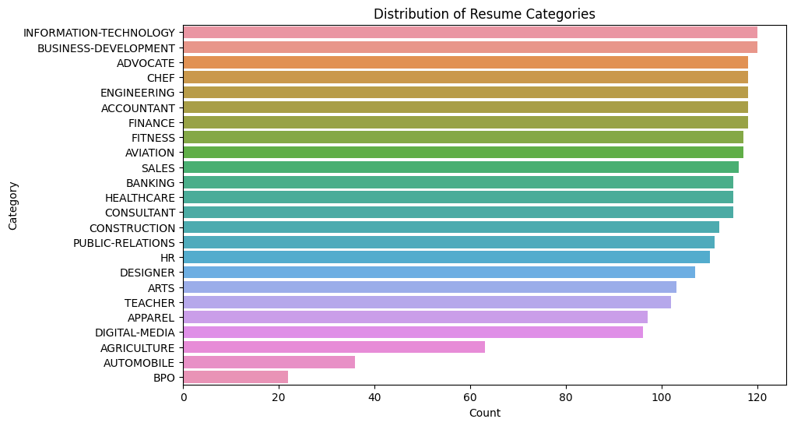
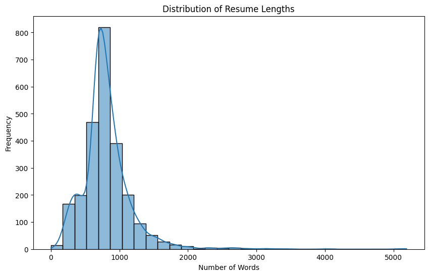
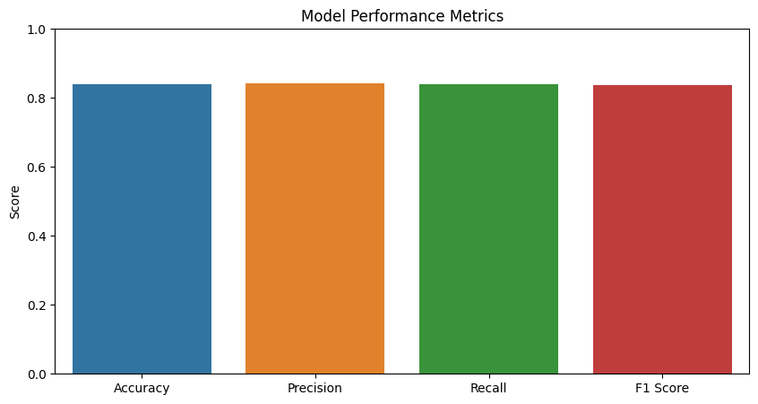

# Resume Classification Project

The aim of the project is to categorizes resumes using a transformer-based document classification model. It involves preprocessing resume data, training a BERT-based model, and creating a Python script that classifies PDF resumes into predefined categories.


## Table of Contents
- [Dataset](#dataset)
- [Model](#model)
- [Environment Setup](#environment-setup)
- [Exploratory Data Analysis (EDA) on Resume datal](#EDAl)
- [Model Configuration and Performance](#model-performance)
- [Visualization](#visualization)
- [Resume Categorization using Command Line Execution](#command-line)


## Dataset
The dataset used in this project consists of:

- **resume.csv**: This file contains the following columns:
  - **ID**: Unique identifier for each resume.
  - **Resume_str**: Text content of the resume.
  - **Resume_html**: HTML content of the resume.
  - **Category**: The actual category to which the resume belongs.
- **Resume_PDF**: A directory containing PDF files named as `{ID}.pdf`, where `ID` corresponds to the `ID` column in `resume.csv`.

## Model
BERT-based transformer model fine-tuned for document classification. The model was trained on the text content of resumes (`Resume_str` column) to predict their respective categories.
## Environment Setup

Requird packages for installation
```bash
fitz==0.0.1.dev2
matplotlib==3.9.2
pandas==2.0.3
scikit_learn==1.5.1
seaborn==0.13.2
torch==2.4.0+cu118
transformers==4.44.1
```
To install the required packages, run the following command
```
pip install -r requirements.txt
```

## Exploratory Data Analysis (EDA) on Resume data
 
The notebook **resume_categorization_using_bert_model_with_EDA.ipynb** consist of EDA, data processing, model training and evaluation

1. Distribution of Resume Categories

    

2. Distribution of Resume Length

    

## Model Configuration and Performance
1. BERT based sequence classification transformers model used for finetune 

    ```python
    model = BertForSequenceClassification.from_pretrained('bert-base-uncased')
    tokenizer = BertTokenizer.from_pretrained('bert-base-uncased')

    ```

2. Performance of the model
    ```
    Test Accuracy: 0.83
    Precision: 0.86
    Recall: 0.83
    F1 Score: 0.84
    ``` 
3. Visualize model performance

    

## Resume Categorization using Command Line Execution
The classification of resumes and moves them to their respective category folders and generate a CSV file named **categorized_resumes.csv**

```bash
python script.py path/to/resume_PDF_directory
```
1. The text of the PDF are extracted using fitz and PyMuPDF 
2. The generated CSV file consist of Filename and Category. This is the sample of the CSV file. 
    
    ```
    Filename 16852973.pdf
    Category:  CONSTRUCTION

    Filename 22323967.pdf
    Category:  CONSTRUCTION

    Filename 33176873.pdf
    Category:  ACCOUNTANT

    Filename 27018550.pdf
    Category:  CONSTRUCTION

    Filename 17812897.pdf
    Category:  CONSTRUCTION
    ```

